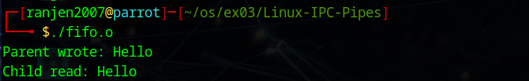
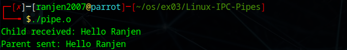

# Linux-IPC--Pipes
Linux-IPC-Pipes


# Ex03-Linux IPC - Pipes

# AIM:
To write a C program that illustrate communication between two process using unnamed and named pipes

# DESIGN STEPS:

### Step 1:

Navigate to any Linux environment installed on the system or installed inside a virtual environment like virtual box/vmware or online linux JSLinux (https://bellard.org/jslinux/vm.html?url=alpine-x86.cfg&mem=192) or docker.

### Step 2:

Write the C Program using Linux Process API - pipe(), fifo()

### Step 3:

Testing the C Program for the desired output. 

# PROGRAM:

## C Program that illustrate communication between two process using unnamed pipes using Linux API system calls

```
#include <stdio.h>
#include <unistd.h>
#include <string.h>
#include <sys/wait.h>

int main() {
    int fd[2];
    pid_t pid;
    char message[] = "Hello";
    char buffer[100];

    if (pipe(fd) == -1) {
        perror("pipe");
        return 1;
    }

    pid = fork();
    if (pid < 0) {
        perror("fork");
        return 1;
    }

    if (pid == 0) {
        close(fd[1]);
        ssize_t n = read(fd[0], buffer, sizeof(buffer) - 1);
        if (n > 0) {
            buffer[n] = '\0';
            printf("Child read: %s\n", buffer);
        }
        close(fd[0]);
    } else {
        close(fd[0]);
        write(fd[1], message, strlen(message) + 1);
        printf("Parent wrote: %s\n", message);
        close(fd[1]);
        wait(NULL);
    }

    return 0;
}
```

## OUTPUT


## C Program that illustrate communication between two process using named pipes using Linux API system calls

```
#include <stdio.h>
#include <unistd.h>
#include <sys/types.h>
#include <sys/stat.h>
#include <fcntl.h>
#include <string.h>
#include <sys/wait.h>

int main() {
    int fd;
    char *fifo = "myfifo";
    char message[] = "Hello Ranjen";
    char buffer[100];
    pid_t pid;

    if (mkfifo(fifo, 0666) == -1) {
        perror("mkfifo");
    }

    pid = fork();
    if (pid < 0) {
        perror("fork");
        return 1;
    }

    if (pid == 0) {
        fd = open(fifo, O_RDONLY);
        ssize_t n = read(fd, buffer, sizeof(buffer) - 1);
        if (n > 0) {
            buffer[n] = '\0';
            printf("Child received: %s\n", buffer);
        }
        close(fd);
    } else {
        fd = open(fifo, O_WRONLY);
        write(fd, message, strlen(message) + 1);
        printf("Parent sent: %s\n", message);
        close(fd);
        wait(NULL);
        unlink(fifo);
    }

    return 0;
}
```

## OUTPUT


# RESULT:
The program is executed successfully.
